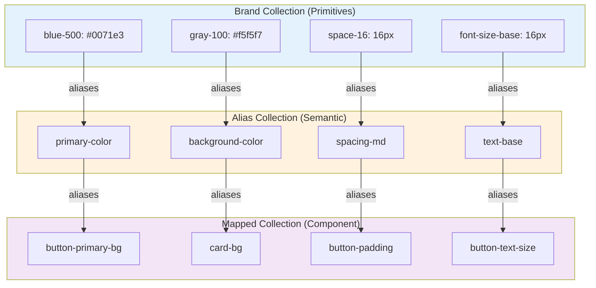

# Figma Variable Structure Documentation

## Overview

This document describes the design token structure for the iOS and iPadOS 26 design system in Figma. The variable system follows a three-tier architecture that separates primitive values (brand), semantic meanings (alias), and component-specific mappings (mapped).

**Source File:** [iOS and iPadOS 26 - Community](https://www.figma.com/design/FadVKxl3VZlR1zcwgtHiPq/iOS-and-iPadOS-26--Community-?node-id=0-1746&t=jRWDIaap8vBWk6XU-1)

### Collection Hierarchy

The design token system is organized into three distinct collections, each serving a specific purpose in the design system:

1. **Brand Collection** (Primitives) - Foundation layer containing raw, unchanging values
2. **Alias Collection** (Semantic) - Middle layer providing meaningful context and functional roles
3. **Mapped Collection** (Component) - Top layer mapping tokens directly to UI components

## Collection Architecture

### Connection Flow

The collections connect through a hierarchical reference system:

```
Brand Collection (Primitives)
    ↓ (referenced by)
Alias Collection (Semantic Tokens)
    ↓ (referenced by)
Mapped Collection (Component Tokens)
```

Each layer references the layer below it, creating a cascading update system where changes to primitives automatically propagate through aliases to mapped tokens.

## Brand Collection (Primitives)

The Brand Collection serves as the foundation of the design system, containing raw, unchanging values that define the core visual language.

### Purpose

- Contains absolute values that rarely change
- Provides the source of truth for all design decisions
- Enables global updates through aliasing

### Variable Types

Brand collections typically include:

- **Colors**: Raw color values (hex, RGB, RGBA)
- **Spacing**: Base spacing units (4px, 8px, 16px, etc.)
- **Typography**: Font families, sizes, weights, line heights
- **Shadows**: Shadow definitions
- **Border Radius**: Base radius values
- **Opacity**: Transparency values

### Example Structure

```
Brand Collection
├── Colors
│   ├── blue-500: #0071e3
│   ├── gray-100: #f5f5f7
│   ├── gray-900: #1d1d1f
│   └── ...
├── Spacing
│   ├── space-4: 4px
│   ├── space-8: 8px
│   ├── space-16: 16px
│   └── ...
├── Typography
│   ├── font-family-primary: SF Pro
│   ├── font-size-base: 16px
│   ├── font-weight-medium: 600
│   └── ...
└── Effects
    ├── shadow-sm: 0 1px 2px rgba(0,0,0,0.05)
    ├── radius-md: 8px
    └── ...
```

### Connection Point: Brand → Alias

Brand variables are referenced directly by Alias collection variables using Figma's aliasing feature. When a brand variable is aliased:

- The alias inherits the brand variable's value
- Changes to the brand variable automatically update all aliases
- The alias can override values for specific modes (e.g., light/dark themes)

## Alias Collection (Semantic Tokens)

The Alias Collection provides semantic meaning to brand primitives, creating a layer of abstraction that describes functional roles rather than raw values.

### Purpose

- Translates primitives into meaningful, context-aware tokens
- Enables theme switching and mode variations
- Provides a consistent vocabulary for design decisions

### Variable Types

Alias collections typically include:

- **Semantic Colors**: `primary`, `secondary`, `background`, `foreground`, `border`, `muted`, `accent`, `destructive`
- **Semantic Spacing**: `padding-sm`, `padding-md`, `padding-lg`, `margin-sm`, etc.
- **Semantic Typography**: `heading-1`, `heading-2`, `body-text`, `caption`, etc.
- **Semantic Effects**: `shadow-elevation-1`, `shadow-elevation-2`, etc.

### Connection Point: Alias → Brand

Alias variables reference Brand variables through aliasing:

```
Alias Variable: primary-color
    ↓ aliases
Brand Variable: blue-500 (#0071e3)
```

### Connection Point: Alias → Mapped

Alias variables are referenced by Mapped collection variables:

```
Mapped Variable: button-primary-bg
    ↓ aliases
Alias Variable: primary-color
    ↓ aliases (chain)
Brand Variable: blue-500
```

### Mode Support

Alias collections often support multiple modes (e.g., Light/Dark), allowing different brand primitives to be referenced based on the active mode:

```
Alias: primary-color
├── Light Mode → Brand: blue-500 (#0071e3)
└── Dark Mode → Brand: blue-400 (#0a84ff)
```

## Mapped Collection (Component Tokens)

The Mapped Collection contains component-specific tokens that directly map to UI elements and their properties.

### Purpose

- Provides direct mapping to design components
- Enables component-level customization
- Maintains consistency across component instances

### Variable Types

Mapped collections typically include:

- **Component Colors**: `button-primary-bg`, `button-secondary-bg`, `card-bg`, `input-border`, etc.
- **Component Spacing**: `button-padding-x`, `button-padding-y`, `card-padding`, etc.
- **Component Typography**: `button-text-size`, `heading-1-size`, `input-text-size`, etc.
- **Component Effects**: `button-shadow`, `card-shadow`, `modal-backdrop`, etc.

### Connection Point: Mapped → Alias/Brand

Mapped variables can reference either Alias or Brand variables:

**Direct to Alias (Recommended):**
```
Mapped: button-primary-bg
    ↓ aliases
Alias: primary-color
    ↓ aliases
Brand: blue-500
```

**Direct to Brand (Less Common):**
```
Mapped: button-custom-bg
    ↓ aliases
Brand: blue-500
```

### Component-Specific Mappings

Mapped collections organize tokens by component:

```
Mapped Collection
├── Button
│   ├── button-primary-bg → Alias: primary-color
│   ├── button-primary-text → Alias: on-primary-color
│   ├── button-padding-x → Alias: spacing-md
│   └── button-padding-y → Alias: spacing-sm
├── Card
│   ├── card-bg → Alias: surface-color
│   ├── card-padding → Alias: spacing-lg
│   └── card-shadow → Alias: elevation-2
└── Input
    ├── input-bg → Alias: background-color
    ├── input-border → Alias: border-color
    └── input-text → Alias: text-primary-color
```

## Connection Architecture

### Visual Representation



### Aliasing Mechanism

Figma's aliasing system creates a dynamic relationship between variables:

1. **Reference Chain**: Variables reference other variables through aliases
2. **Automatic Updates**: Changes propagate automatically through the chain
3. **Mode Resolution**: Variables can resolve to different values based on active modes
4. **Cross-Collection References**: Variables can reference variables from other collections

### Mode Resolution Logic

When multiple modes exist (e.g., Light/Dark), the resolution follows this logic:

1. Check if the variable has a value for the active mode
2. If not, check parent collection modes
3. Resolve through the alias chain respecting mode settings
4. Fall back to default mode if no match found

**Example:**
```
Mode: Dark
Mapped: button-primary-bg (Dark mode)
    ↓ resolves to
Alias: primary-color (Dark mode)
    ↓ resolves to
Brand: blue-400 (#0a84ff) (Dark mode value)
```

## Variable Examples

### Example Chain 1: Color Token

**Brand → Alias → Mapped**

```
Brand Collection:
  blue-500 = #0071e3

Alias Collection:
  primary-color → aliases → blue-500

Mapped Collection:
  button-primary-bg → aliases → primary-color
  card-primary-border → aliases → primary-color
  link-color → aliases → primary-color
```

**Result:** Changing `blue-500` to `#0066cc` automatically updates `primary-color`, which updates all mapped tokens (`button-primary-bg`, `card-primary-border`, `link-color`).

### Example Chain 2: Spacing Token

**Brand → Alias → Mapped**

```
Brand Collection:
  space-16 = 16px

Alias Collection:
  spacing-md → aliases → space-16

Mapped Collection:
  button-padding-x → aliases → spacing-md
  card-padding → aliases → spacing-md
  input-padding → aliases → spacing-md
```

**Result:** Changing `space-16` to `18px` updates all components using `spacing-md`.

### Example Chain 3: Cross-Collection Reference

**Mapped → Alias → Brand (Multiple)**

```
Brand Collection:
  blue-500 = #0071e3
  white = #ffffff

Alias Collection:
  primary-color → aliases → blue-500
  on-primary-color → aliases → white

Mapped Collection:
  button-primary-bg → aliases → primary-color
  button-primary-text → aliases → on-primary-color
```

**Result:** Both background and text colors are independently managed but used together in the component.

## Collection Modes

### Mode Structure

Collections can have multiple modes that allow different values for the same variable:

**Brand Collection Modes:**
- Typically no modes (single source of truth)

**Alias Collection Modes:**
- Light Mode
- Dark Mode
- High Contrast Mode (optional)

**Mapped Collection Modes:**
- Light Mode
- Dark Mode
- Component Variants (e.g., Button: Default, Hover, Active)

### Mode Inheritance

When a variable references another variable through an alias:

1. The variable inherits modes from its parent collection
2. Mode-specific values can override inherited values
3. Missing mode values fall back to the default mode

## Best Practices

### When to Use Each Collection

**Use Brand Collection for:**
- Raw color values (hex codes, RGB values)
- Base spacing units (4px, 8px, 16px increments)
- Font family names
- Base font sizes and weights
- Shadow definitions
- Border radius values

**Use Alias Collection for:**
- Semantic color names (primary, secondary, background, foreground)
- Contextual spacing (padding-sm, margin-lg)
- Typography scales (heading-1, body-text, caption)
- Elevation levels (shadow-elevation-1, shadow-elevation-2)
- Theme-specific variations (light/dark mode values)

**Use Mapped Collection for:**
- Component-specific properties (button-primary-bg, card-padding)
- UI element tokens (input-border-color, modal-backdrop)
- Component state tokens (button-hover-bg, input-focus-border)
- Component size tokens (button-large-padding, input-small-height)

### Naming Conventions

**Brand Collection:**
- Use descriptive names: `blue-500`, `gray-100`, `space-16`
- Include value indicators: `font-size-16`, `font-weight-600`
- Use kebab-case: `border-radius-md`

**Alias Collection:**
- Use semantic names: `primary-color`, `background-color`, `text-primary`
- Describe function, not appearance: `interactive-color` not `blue-color`
- Use kebab-case: `spacing-medium`, `text-heading-1`

**Mapped Collection:**
- Use component-prefixed names: `button-primary-bg`, `card-padding`
- Include property type: `-bg`, `-text`, `-border`, `-padding`
- Use kebab-case: `input-focus-border-color`

### Adding New Variables

**To add a new primitive:**
1. Add to Brand Collection with a descriptive name
2. Use consistent naming patterns
3. Document the value and usage

**To add a new semantic token:**
1. Add to Alias Collection
2. Reference appropriate Brand variable(s)
3. Set mode-specific values if needed
4. Use semantic naming

**To add a new component token:**
1. Add to Mapped Collection
2. Reference Alias variable (preferred) or Brand variable
3. Use component-prefixed naming
4. Document which component uses it

### Maintaining the System

1. **Never break the chain**: Always maintain Brand → Alias → Mapped references
2. **Avoid circular references**: Variables should not reference themselves or create loops
3. **Document changes**: Update this documentation when adding new variables
4. **Test mode switching**: Verify all modes work correctly after changes
5. **Review aliases regularly**: Ensure aliases still reference appropriate primitives

## Collection Connection Summary

### Key Connection Points

1. **Brand → Alias**: Alias variables reference Brand variables to create semantic meaning
2. **Alias → Mapped**: Mapped variables reference Alias variables for component-specific tokens
3. **Mapped → Brand**: Less common, but Mapped can directly reference Brand for custom cases

### Benefits of This Structure

- **Maintainability**: Change primitives once, update everywhere
- **Consistency**: Semantic tokens ensure consistent usage
- **Flexibility**: Component tokens allow component-specific customization
- **Scalability**: Easy to add new tokens following the pattern
- **Theme Support**: Mode system enables light/dark themes

### Resolution Flow

When a variable is used in a design:

1. Check Mapped Collection for component-specific token
2. If aliased, resolve through Alias Collection
3. If aliased further, resolve through Brand Collection
4. Apply mode-specific value if available
5. Return final resolved value

## Notes

- This structure follows Figma's recommended three-tier token architecture
- Collections can be extended for platform-specific needs (iOS vs iPadOS)
- Variables support code syntax for multiple platforms (WEB, iOS, ANDROID)
- The aliasing system enables bi-directional syncing with code repositories
- Collection modes allow for theme variations and component states

---

**Last Updated:** [Date to be filled]
**Figma File:** [iOS and iPadOS 26 - Community](https://www.figma.com/design/FadVKxl3VZlR1zcwgtHiPq/iOS-and-iPadOS-26--Community-?node-id=0-1746&t=jRWDIaap8vBWk6XU-1)
